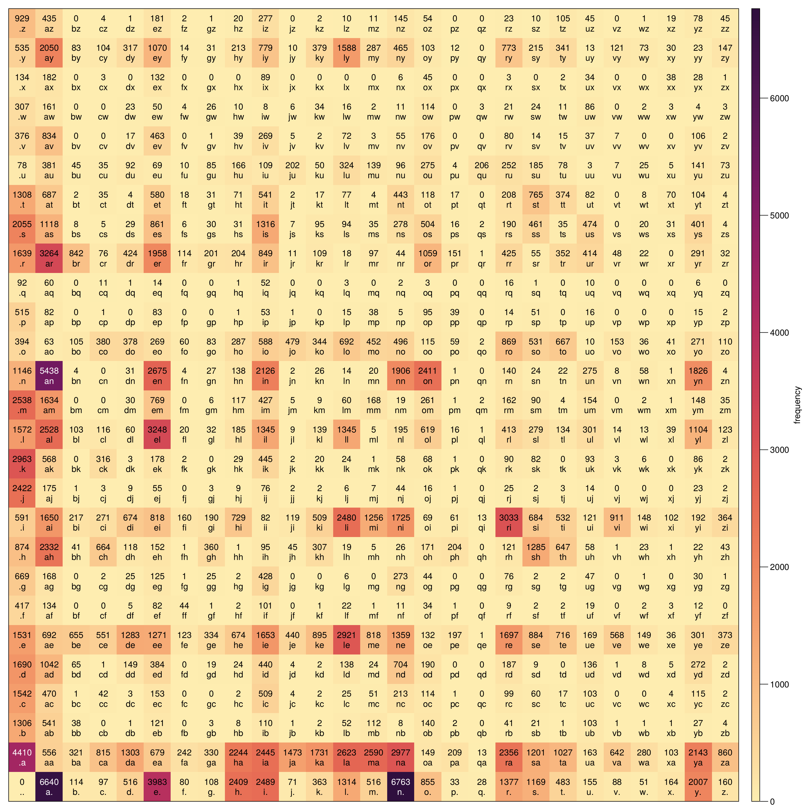
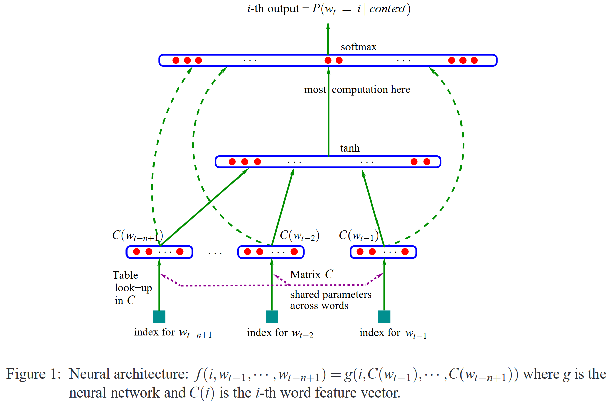
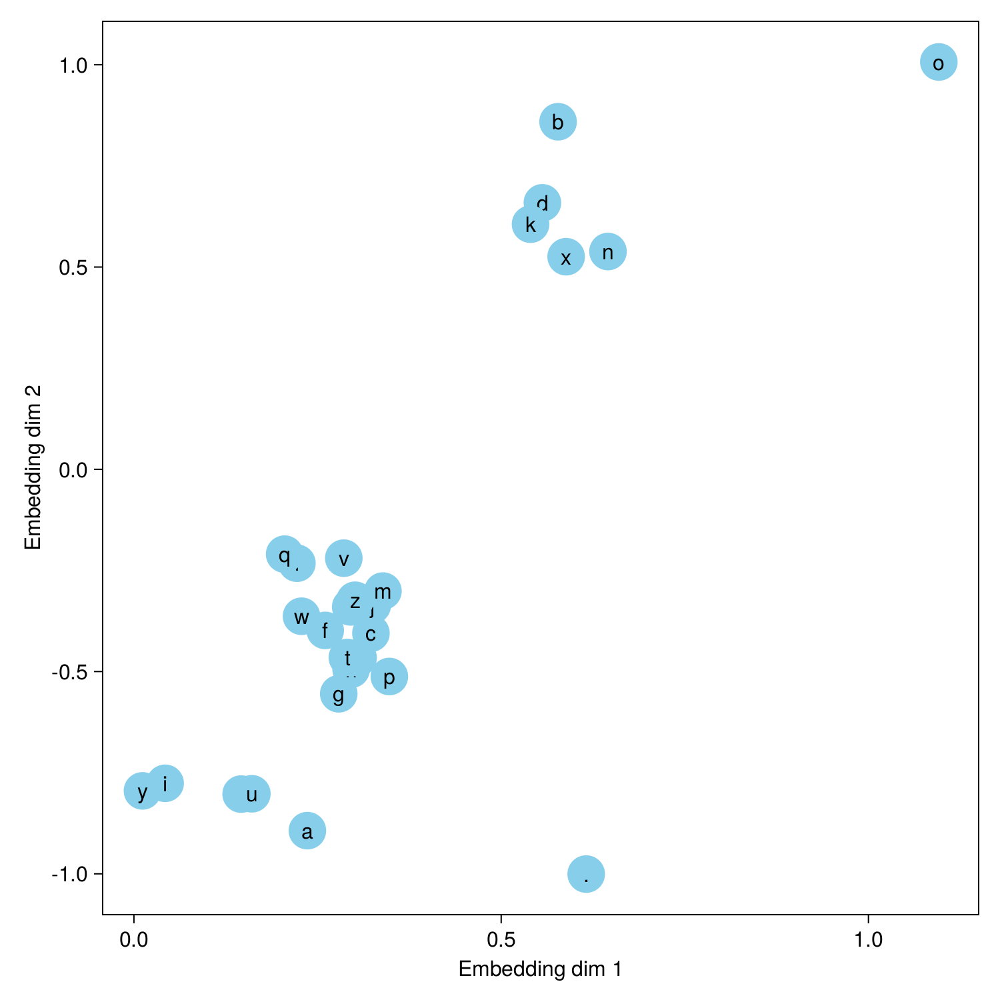

# MakeMore.jl

A Julia implementation of makemore.

## Bigram model

Here is the bigram frequency from `names.txt`:



Sampling from this simple bigram model produces mostly nonsensical names with the occasional name-like one. A simple one-layer neural network can be trained to learn the bigrams too.

```text
ce
callonayava
phalun
jan
siselliannl
tayanenn
an
amagh
gwa
ggerre
ksan
ghiy
h
moh
cecaitlerma
zlsizush
denamalesyvapiy
keeeora
ses
keri
keian
miyha
nayianynen
ez
lo
```

## Multilayer perceptron

Following the multilayer perceptron (MLP) architecture described by Bengio et al. (2003)



a neural network can learn multi-dimensional embeddings for each letter and interchange "similar" letters to produce names. Here it seems to have learned that vowels are "similar" (except for `o` for some reason) and finds a couple of larger clusters. Sampling from this multi-layer perceptron produces more realistic sounding names.



```text
jaline
mamiro
mayah
aoharri
sarien
kavui
eocusyah
qin
jolina
deyne
cyn
ren
moo
caleo
koriyah
arhry
jaonin
dlanryunntyalaonie
kinils
kie
padiri
jayke
deynleeh
masirae
jelin
```
